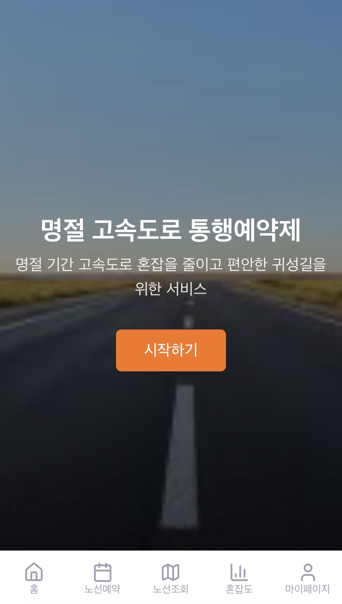
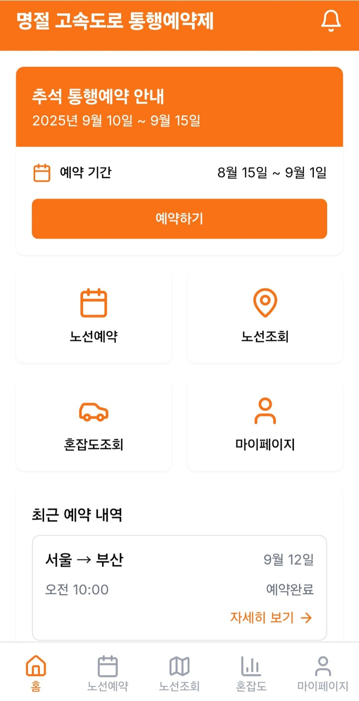
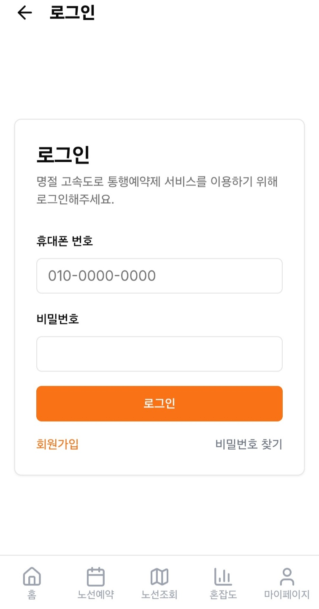
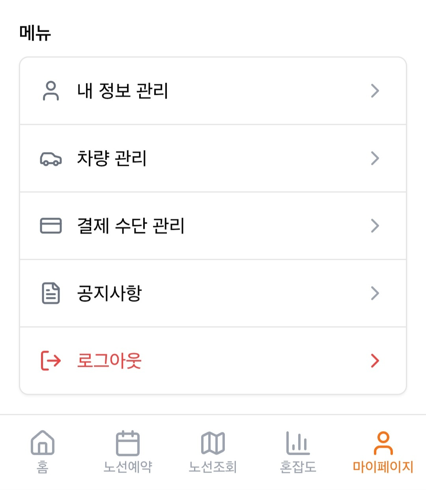
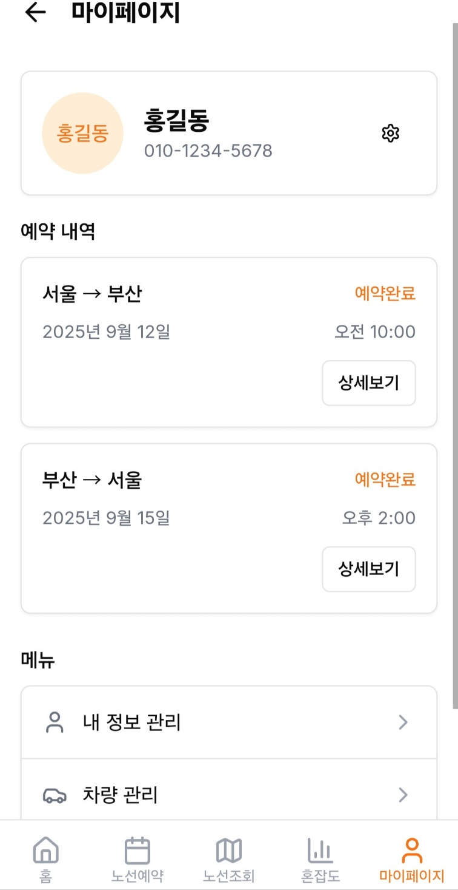
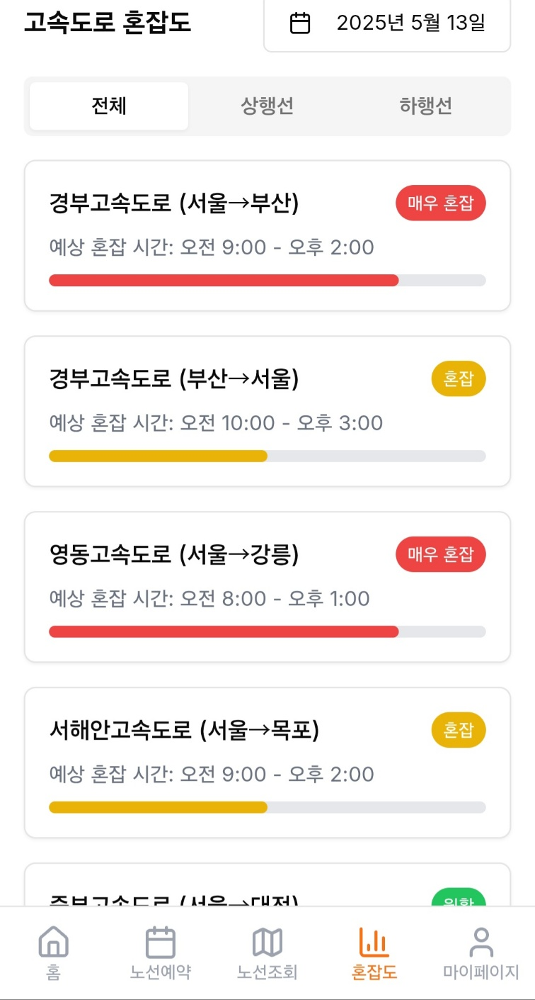
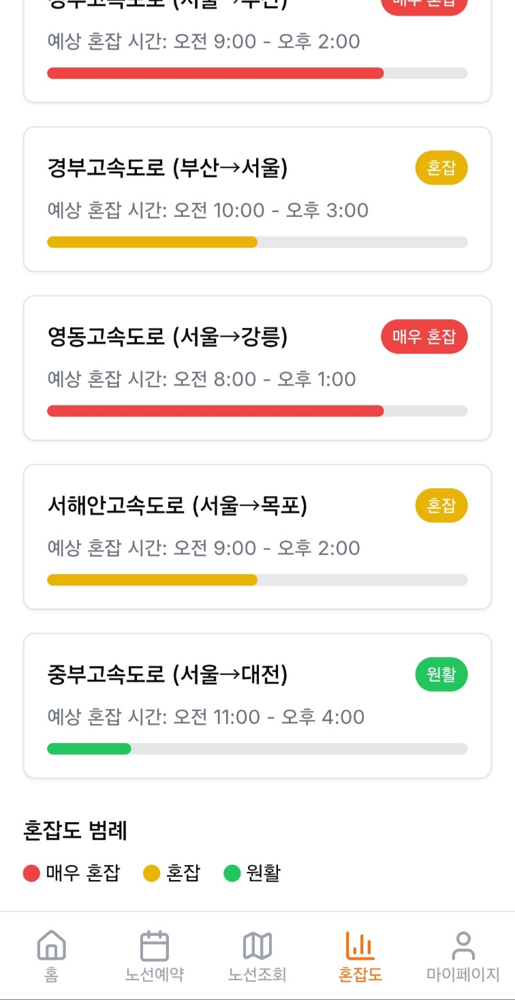

# 공공데이터 기반 고속도로 통행 예약 서비스 기획

> **명절 기간 집중되는 고속도로 교통량을 공공데이터로 분석하고,  
> 사전 예약과 인센티브를 통해 교통량을 분산하는 데이터 기반 서비스를 기획했습니다.**

**2025 국토교통 데이터활용 경진대회 서비스 기획 프로젝트**

---

## 1. 프로젝트 소개

명절마다 특정 시간대와 고속도로 구간에 차량이 집중되면서 반복적인 교통 정체가 발생합니다.

기존 교통 서비스는 실시간 교통 상황을 제공하거나 정체 발생 이후 우회 경로를 안내하는 방식이 중심입니다.

이 프로젝트에서는 **정체가 발생한 이후 대응하는 것이 아니라, 이동 수요 자체를 사전에 분산할 수 없을까?**라는 문제에서 출발했습니다.

한국도로공사의 교통량 데이터를 분석해 명절 기간의 교통량 증가를 확인하고, 사용자가 이동 시간과 고속도로 구간을 사전에 예약하도록 유도하는 **「명절 고속도로 통행 예약 서비스」**를 기획했습니다.

예약하지 않은 차량의 통행을 제한하는 방식이 아니라, 예약 이용자에게 혜택을 제공하여 **자발적인 교통량 분산을 유도하는 것**이 핵심입니다.

---

## 2. 문제 정의

### 명절에 반복되는 고속도로 정체

명절에는 귀성·귀경 차량이 특정 시간대에 집중되면서 평상시보다 높은 교통량이 발생합니다.

이를 확인하기 위해 한국도로공사의 **일자별 전국 교통량 데이터**를 활용하여 설날 당일과 일반 날짜의 교통량을 비교했습니다.

| 구분 | 날짜 | 전국 교통량 |
|---|---|---:|
| 설날 당일 | 2023.01.22 | **4,391,185대** |
| 비교일 | 2023.02.22 | **3,102,250대** |

설날 당일에는 비교일보다 약 **128만 대 많은 차량**이 고속도로를 이용했으며, 약 **1.42배 수준의 교통량**이 확인되었습니다.

이러한 수요 집중은 단순한 이동시간 증가뿐만 아니라 정체로 인한 연료 소비, 운전자 피로, 사고 위험 및 도로 운영 부담으로 이어질 수 있습니다.

### 기존 방식의 한계

현재의 교통 정보 서비스는 주로

- 실시간 교통 상황 제공
- 예상 소요시간 안내
- 정체 발생 시 우회 경로 제공

등 **정체가 발생한 이후 운전자의 이동을 지원하는 방식**에 집중되어 있습니다.

따라서 본 프로젝트에서는 교통량을 예측하는 것을 넘어 **특정 시간대에 집중되는 이동 수요를 사전에 분산하는 서비스**를 제안했습니다.

---

## 3. 서비스 제안


### 명절 고속도로 통행 예약 서비스

명절 기간 동안 사용자가 자신이 이용할

**출발 IC → 도착 IC → 이용 날짜 → 이용 시간**

을 사전에 예약하는 서비스입니다.

시간대별 예약 현황과 교통 데이터를 기반으로 혼잡도를 제공하여 이용자가 상대적으로 교통량이 적은 시간대를 선택할 수 있도록 지원합니다.

### 핵심 운영 방식

```text
이동 구간 선택
      ↓
이용 날짜 및 시간 선택
      ↓
시간대별 예상 혼잡도 확인
      ↓
통행 예약
      ↓
예약 시간대에 고속도로 이용
      ↓
예약 이용자 인센티브 제공
```

서비스의 목적은 특정 시간의 차량 통행을 강제로 제한하는 것이 아닙니다.

**혼잡 시간대를 시각적으로 보여주고 예약 이용자에게 혜택을 제공하여 이용자가 스스로 이동 시간을 분산하도록 유도하는 구조**로 설계했습니다.

---

## 4. 핵심 기능

### ① 고속도로 통행 예약

사용자가 고속도로 진입·진출 IC와 이용 날짜 및 시간을 선택하여 통행을 예약합니다.

예약 과정에서 시간대별 예약 현황을 제공하여 특정 시간대에 차량이 과도하게 집중되는 것을 방지합니다.

### ② 혼잡도 조회

고속도로 구간의 교통 상황을

- 매우 혼잡
- 혼잡
- 원활

등으로 시각화하여 제공합니다.

상행선과 하행선을 구분하고 날짜별 교통 상황도 확인할 수 있도록 설계했습니다.

### ③ 예약 내역 및 차량 관리

마이페이지를 통해

- 예약 내역 확인
- 차량 등록 및 관리
- 결제수단 관리
- 사용자 정보 관리

기능을 이용할 수 있도록 구성했습니다.

### ④ 예약 이용자 인센티브

비예약 차량을 제한하거나 패널티를 부과하는 대신 **예약 참여자에게 혜택을 제공하는 방식**을 채택했습니다.

이를 통해 이동권을 제한하지 않으면서 사용자의 자발적인 참여를 유도하고자 했습니다.

---

## 5. 데이터 활용

서비스 기획과 운영을 위해 다음과 같은 국토·교통 데이터를 활용하도록 설계했습니다.

### 활용 공공데이터

| 데이터 | 활용 목적 |
|---|---|
| 일자별 전국 교통량 | 명절과 일반 기간의 교통량 비교 |
| 실시간 전국 교통량 | 현재 고속도로 혼잡도 파악 |
| 고속도로 교통사고 데이터 | 교통량과 안전 문제 분석 |
| 구간·지점별 속도 데이터 | 정체 구간 판단 |
| 톨게이트 이용 기록 | 구간별 통행량 분석 |

주요 데이터는 **한국도로공사 및 국토교통 관련 공공데이터**를 기반으로 활용하는 것을 전제로 기획했습니다.

### 서비스 운영 데이터

서비스가 실제 운영될 경우 다음과 같은 데이터가 추가로 생성됩니다.

- 예약 시간대
- 출발·도착 IC
- 차량 정보
- 실제 통행 시간
- 시간대별 예약량
- 구간별 이용량

이를 기존 교통 데이터와 결합하면 **실시간 상황을 보여주는 것을 넘어 미래의 교통 수요를 사전에 파악하는 데이터**로 활용할 수 있습니다.

---

## 6. K-MaaS 연계

별도의 독립 앱을 새롭게 구축하는 방식보다 기존 **K-MaaS(Mobility as a Service)** 플랫폼에 통행 예약 기능을 연계하는 방향을 고려했습니다.

대중교통·공유교통 등 다양한 이동수단을 하나의 플랫폼에서 연결하는 MaaS의 특성을 활용해 고속도로 통행 예약 역시 하나의 이동 서비스로 통합하는 방식입니다.

이를 통해 사용자가 여러 서비스를 별도로 이용해야 하는 불편을 줄이고 향후 내비게이션 및 다른 모빌리티 서비스와 연계할 수 있도록 확장성을 고려했습니다.

---

## 7. 서비스 UI/UX

서비스 이용 흐름에 맞춰 주요 화면을 설계했습니다.


### 초기 화면




- 명절 통행 예약 기간 안내
- 노선 예약
- 예약 노선 조회
- 고속도로 혼잡도 조회

### 로그인 / 마이페이지






- 사용자 정보 관리
- 등록 차량 관리
- 예약 내역 확인
- 결제수단 관리
- 공지사항

### 노선 예약


사용자가

`출발 IC → 도착 IC → 날짜 → 시간`

순서로 입력하여 예약할 수 있도록 구성했습니다.

모든 정보를 입력하면 예약 버튼이 활성화되며, 예약 전 이용 시 주의사항을 확인할 수 있도록 설계했습니다.

### 혼잡도 조회




날짜와 상·하행선을 선택하여 고속도로의 구간별 혼잡도를 확인할 수 있도록 구성했습니다.

> **UI/UX 시안 추가적인 이미지는 UI_images 폴더를 통해 확인하실 수 있습니다.**


---

## 8. 서비스 실효성 검토

초기에는 예약하지 않은 차량에 패널티를 적용하는 방식도 검토했습니다.

하지만 고속도로 이용을 직접 제한하거나 미예약 차량에 제재를 부과하는 방식은 이동권과 법적 근거에 대한 추가적인 검토가 필요하다고 판단했습니다.

이에 최종적으로 **강제적인 통행 제한보다 인센티브 중심의 자발적 예약 방식**으로 서비스 방향을 구체화했습니다.

```text
강제 통행 제한 ❌
미예약 차량 패널티 ❌

예약 이용자 혜택 제공 ⭕
자발적인 시간대 분산 ⭕
시범 운영을 통한 효과 검증 ⭕
```

서비스 도입 초기에는 시범 운영을 통해 예약률과 실제 교통량 변화를 분석하고, 확보된 데이터를 기반으로 제도를 단계적으로 개선하는 방식을 고려했습니다.

---

## 9. 기대 효과

### 🚘 교통 혼잡 완화

특정 시간대에 집중되는 차량을 여러 시간대로 분산하여 명절 고속도로의 집중적인 교통 수요를 완화합니다.

### 📊 데이터 기반 도로 운영

사전 예약 데이터를 활용하면 특정 시간과 구간의 예상 차량 수를 미리 파악할 수 있습니다.

이를 통해 톨게이트 운영, 교통 관리 및 인력 배치 등의 의사결정에 활용할 수 있습니다.

### 🛡️ 교통 안전성 향상

교통량 집중이 완화되면 정체 구간에서 발생할 수 있는 사고 위험과 사고로 인한 2차 정체를 줄이는 데 기여할 수 있습니다.

### 🌱 환경적 비용 감소

정체 및 서행 시간이 감소하면 불필요한 연료 소비와 차량 배출을 줄이는 효과도 기대할 수 있습니다.

### 🗺️ 모빌리티 서비스 확장

향후 예약 데이터를 내비게이션과 연계하면 예약 시간과 교통 상황을 고려한 경로 추천 및 우회 안내 서비스로 확장할 수 있습니다.

---

## 10. 향후 발전 방향

서비스가 실제 운영된다는 가정하에 다음과 같은 확장을 고려했습니다.

- 명절 시범 운영 후 주말·공휴일 확대
- 민간 내비게이션 서비스와 연계
- 예약량 기반 교통량 예측 모델 구축
- 실시간 교통 데이터와 예약 데이터 결합
- 개인별 최적 출발 시간 추천
- 물류 차량 및 화물 도로 예약 시스템으로 확장

궁극적으로 단순히 **현재의 정체를 알려주는 서비스**에서 벗어나,

> **앞으로 발생할 교통 수요를 미리 파악하고 분산시키는 데이터 기반 교통 관리 서비스**

로 발전시키는 것을 목표로 했습니다.

---

## 11. 프로젝트에서 수행한 내용

- 국토·교통 분야 문제 정의 및 서비스 아이디어 기획
- 한국도로공사 공공데이터 탐색 및 교통량 비교 분석
- 명절 고속도로 통행 예약 서비스 구조 설계
- 핵심 기능 및 사용자 이용 Flow 설계
- 서비스 UI/UX 화면 기획
- 서비스 운영에 필요한 데이터 정의
- K-MaaS 연계 방안 검토
- 통행 예약제의 법적·제도적 실효성 검토
- 강제적 예약 방식에서 **인센티브 기반 참여 방식으로 서비스 개선**
- 향후 데이터 기반 교통수요 관리 서비스 확장 방안 설계

---

## 12. Project Info

| 항목 | 내용 |
|---|---|
| 프로젝트 | 2025 국토교통 데이터활용 경진대회 |
| 분야 | Data Service / Mobility |
| 주제 | 공공데이터 기반 고속도로 통행 예약 서비스 |
| 형태 | 서비스·정책 기획 |
| 주요 데이터 | 한국도로공사 교통량 및 교통 관련 공공데이터 |
| 주요 키워드 | `Public Data` `Mobility` `Data Analysis` `Service Planning` `K-MaaS` |
